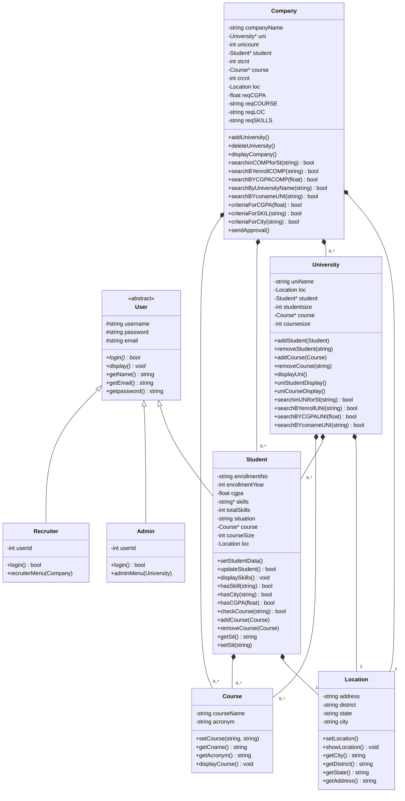
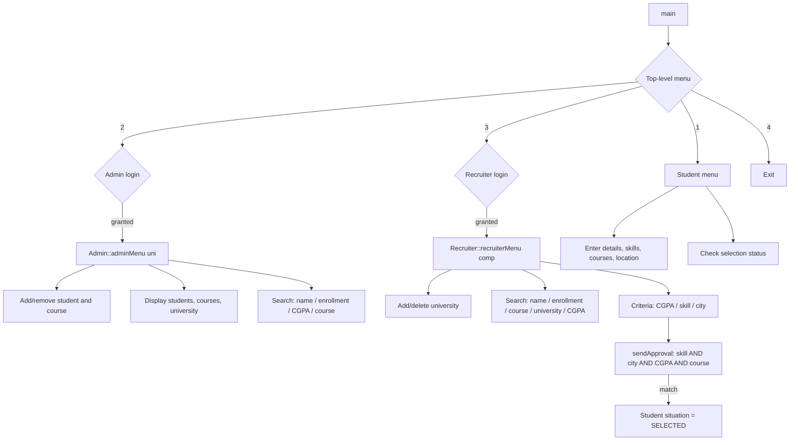
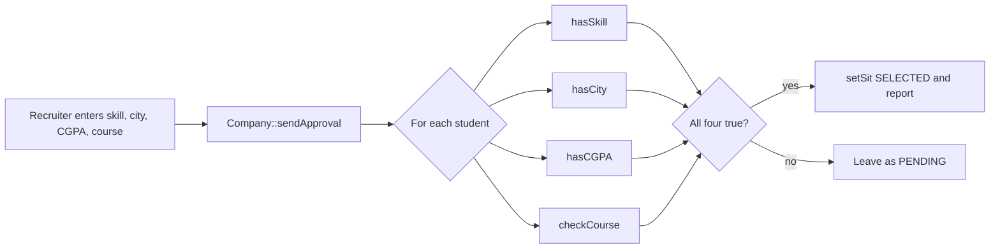

# Architecture

How the Intern Management System is put together, and which C++ OOP concept each
part of the code demonstrates.

> This document describes **only the code that actually exists** in the
> repository. The file [`readmeIMS.txt`](../readmeIMS.txt) at the repository root
> is an earlier design sketch of a much larger system; most of the classes in it
> (vacancies, applications, interviews, resumes, reports, `DatabaseManager`)
> were never implemented. It is kept as a record of the original design thinking.

---

## 1. Class hierarchy



`#` = protected, `-` = private, `+` = public, `*` on a method = pure virtual.

Every `*--` above is a real composition: `Location` is embedded by value, and
the rest are `new[]` arrays owned and `delete[]`d by the class on the left.

---

## 2. Files and responsibilities

| File | Lines | Responsibility |
| ---- | ----- | -------------- |
| `main.cpp` | 157 | Entry point. Prints the banner, owns the top-level menu loop, creates the `Admin`, `Recruiter`, `University`, `Company` and `Student` objects, and dispatches to the role menus. |
| `User.h` | 94 | Abstract base class. Holds the shared credentials (`username`, `password`, `email`), validates the 4-character password rule, and declares `display()` and `login()` as pure virtual. |
| `Student.h` | 440 | The largest class. Academic record, dynamic skills array, dynamic course array, nested `InvalidCgpaException`, profile entry/update, profile display, and the three predicate methods (`hasSkill`, `hasCity`, `hasCGPA`) that the recruiter filters depend on. |
| `Admin.h` | 212 | University administration menu: add/remove students and courses, display records, and a four-mode search submenu. |
| `Recruiter.h` | 238 | Company-side menu: manage universities, search the student pool, run criteria filters, and trigger approval. |
| `University.h` | 378 | Owns `Student*` and `Course*` dynamic arrays and exposes the add/remove/display/search operations on them. |
| `Company.h` | 540 | Owns `University*`, `Student*` and `Course*` dynamic arrays, implements the three criteria filters, and implements `sendApproval()` where the four-condition match happens. |
| `Course.h` | 60 | Value class holding a course name and acronym, with two `operator==` overloads. |
| `Location.h` | 85 | Value class holding address, district, state and city, with interactive input and display methods. |

---

## 3. OOP concepts used, and where

### 3.1 Abstraction and inheritance

`User` is an abstract base class:

```cpp
virtual void display() = 0;
virtual bool login() = 0;
```

`Student`, `Admin` and `Recruiter` all derive from it, so the same three fields
(`username`, `password`, `email`) and the same `getName()` / `getEmail()` /
`getpassword()` accessors are shared. Each subclass supplies its own
`display()` and `login()`.

`Admin` and `Recruiter` each re-implement an identical `login()` body, which is
a candidate for hoisting into `User`.

### 3.2 Polymorphism

`Admin::display()` and `Recruiter::display()` override the pure virtual, and
`display()` is called on concrete `Student` objects held in `Student*` arrays
throughout `University` and `Company`.

### 3.3 Encapsulation

All data members are `private` or `protected`. Access is through `const` getters
such as `getEnrollmentNo()`, `getCGPA()`, `getSit()`, `getStudentCity()` and
`getCname()`. Many getters are marked `const`, though not all consistently.

### 3.4 Composition

`Location` is held **by value** inside `Student`, `University` and `Company`.
Because it is a value member rather than a pointer, there is nothing to
allocate or free, and copies are correct automatically.

### 3.5 Dynamic memory

`Student::skills`, `Student::course`, `University::student`, `University::course`,
`Company::uni`, `Company::student` and `Company::course` are raw pointers to
arrays allocated with `new[]` and released with `delete[]` in the destructors.

Growth and shrink operations (`addCourse`, `removeCourse`, `addStudent`,
`removeStudent`, `addUniversity`, `deleteUniversity`) all follow the same manual
reallocation pattern:

1. Allocate a new array of the required size.
2. Copy the existing elements across.
3. `delete[]` the old array.
4. Repoint the member and update the size counter.

This is correct but verbose — `std::vector` would remove all of it.

### 3.6 Rule of Three

Because several classes own raw pointers, each one implements all three of:

- a **copy constructor** that performs a deep copy (`Student.h:334`, `University.h:194`, `Company.h:136`)
- an **assignment operator** that releases the old buffer before deep-copying
  (`User.h:81`, `Student.h:108`, `University.h:333`, `Company.h:187`)
- a **destructor** that calls `delete[]` (`Student.h:435`, `University.h:373`, `Company.h:534`)

### 3.7 Operator overloading

| Operator | Location | Behaviour |
| -------- | -------- | --------- |
| `operator=` | `User.h:81`, `Student.h:108`, `University.h:333`, `Company.h:187` | Deep-copy assignment with self-check |
| `operator==` | `Course.h:46`, `Course.h:53`, `Student.h:430`, `University.h:317` | Course name+acronym, course name vs `string`, enrollment number, university name+size |
| `operator>` | `Student.h:426` | Compares CGPA |

### 3.8 Custom exceptions

Two exception classes are declared **nested inside** their owning class, which
scopes them to the type that raises them:

```cpp
class User {
public:
    class PasswordException { ... };   // User.h:15
};

class Student : public User {
public:
    class InvalidCgpaException { ... }; // Student.h:24
};
```

- `User`'s constructor throws `PasswordException` if the password length is not
  exactly 4 (`User.h:38`).
- `Student`'s constructor and `setStudentData()` throw `InvalidCgpaException`
  if CGPA is negative (`Student.h:54`, `Student.h:286`).

Both are caught in `main.cpp` with `try` / `catch` at the menu level
(`main.cpp:56`, `main.cpp:104`, `main.cpp:123`).

### 3.9 Header guards

Every header wraps its contents in `#ifndef` / `#define` / `#endif` and the
project relies on that, because the headers include each other and some
include chains are cyclic (for example `Student.h` → `Course.h`, and
`Company.h` → `University.h` → `Student.h`).

### 3.10 Single translation unit

There is no `.cpp` file per class. `main.cpp` is the only translation unit and
includes all eight headers, so linking only needs `main.o` — which is exactly
what `Makefile.win` does.

---

## 4. Control flow



Data flow for approval, the central business rule of the system:



---

## 5. Object ownership at startup

`main.cpp` creates these objects, all with automatic storage duration:

| Object | Line | Notes |
| ------ | ---- | ----- |
| `Admin admin("adm", "1234", "admin@uni.edu", 1)` | `main.cpp:16` | Hardcoded demo credentials |
| `Recruiter rec("rec", "1234", "rec@company.com", 101)` | `main.cpp:18` | Hardcoded demo credentials |
| `University uni` | `main.cpp:20` | Default-constructed: empty name, null arrays. Filled by the admin menu. |
| `Company comp` | `main.cpp:21` | Default-constructed: empty name, null arrays. Filled by the recruiter menu. |
| `Student obj` | `main.cpp:22` | The single student instance used by the student menu. |

---

## 6. Known architectural weaknesses

Documented in full under **Limitations** in the root [README](../README.md#-limitations).
The three that matter most for anyone reading the design:

1. **Three disconnected data stores.** `University` owns one `Student*` array,
   `Company` owns a second `Student*` array, and `main.cpp` owns a third
   standalone `Student obj`. A student added by the admin is a *copy* living in
   a different array from the one the recruiter searches, and neither is the one
   the student menu edits. A single shared repository object would fix this.

2. **No persistence layer.** All data is lost on exit. The `DatabaseManager`
   class in the original design sketch was never implemented.

3. **Manual array management.** The `new[]` / copy / `delete[]` pattern is
   repeated about a dozen times and is the most likely source of the remaining
   bugs. `std::vector<T>` removes the entire category of error.

There is also one outright defect worth naming here because it sits in a core
code path: `Company::addUniversity()` (`Company.h:348`) reads counts into
`stcnt`/`crcnt` but passes the **uninitialised** `stsize`/`crsize` to
`setUniversity()`, and iterates `student[i].setStudentData()` over `stcnt`
before the `student` array has been allocated.
